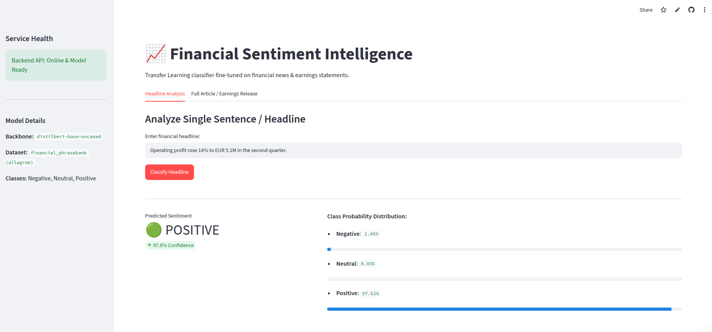
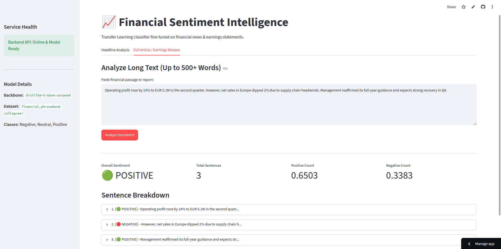

# 📈 Financial Sentiment Intelligence

[](https://fastapi.tiangolo.com/)
[](https://streamlit.io/)
[](https://huggingface.co/)
[](https://www.docker.com/)

An end-to-end NLP transfer learning service designed to classify financial headlines, earnings releases, and market commentary into **Positive**, **Neutral**, or **Negative** sentiment with calibrated confidence scores.

The platform fine-tunes a `distilbert-base-uncased` transformer on the Financial PhraseBank dataset, serving predictions via a decoupled **FastAPI** inference backend and an interactive **Streamlit** dashboard.


*Caption: Real-time financial headline sentiment classification with calibrated probability distribution.*


*Caption: Multi-sentence financial document breakdown with sentence-level tagging and overall sentiment aggregation.*


---

## ⚡ Key Features

- **Domain-Adapted Transfer Learning:** Fine-tuned `distilbert-base-uncased` on financial domain texts to detect nuance in earnings reports and regulatory filings.
- **Microservices-Ready REST API:** Production-grade FastAPI endpoints with structured Pydantic schemas, health checks, and sub-second inference latency.
- **Document-Level Aggregation:** Analyzes long-form financial passages sentence-by-sentence to produce an overall document sentiment score alongside individual breakdowns.
- **Interactive Web Interface:** Streamlit-powered dashboard featuring visual confidence metrics, class probability bars, and expandable sentence explorers.
- **Production Containerization:** Fully containerized multi-service deployment with Docker Compose, internal DNS routing, and automated test coverage.

---

## 🏗️ System Architecture

This project decouples the heavyweight training pipeline from production inference, ensuring lean serving containers and reproducible deployments.

```text
[Financial Text / Market News]
               │
               ▼
┌──────────────────────────────┐
│     Streamlit Dashboard      │ ── (Web UI Port 8501)
└──────────────┬───────────────┘
               │
               │ HTTP POST /predict (Internal Docker Network)
               ▼
┌──────────────────────────────┐
│     FastAPI Serving API      │ ── (REST Engine Port 8000)
│   ├── Pydantic Input Guard   │
│   ├── Hugging Face Pipeline  │
│   └── Multi-Sentence Parser  │
└──────────────┬───────────────┘
               │
               ▼ (Reads safetensors & config)
┌──────────────────────────────┐
│   Trained Model Artifacts    │ ── (distilbert-base-uncased weights)
│   (artifacts/final_model/)   │
└──────────────────────────────┘

```

---

## 📁 Repository Structure

```text
├── artifacts/
│   └── final_model/          # Fine-tuned safetensors, vocab & config (git-ignored)
├── docker/
│   ├── Dockerfile.serve      # Production serving container (API + UI)
│   └── Dockerfile.train      # Dedicated training container
├── src/
│   ├── api/
│   │   ├── main.py           # FastAPI entrypoint & lifecycle hooks
│   │   ├── route.py          # API route definitions (/health, /predict)
│   │   ├── schemas.py        # Pydantic request/response validation
│   │   └── service.py        # Predictor singleton service wrapper
│   ├── app_ui.py             # Streamlit visual dashboard
│   ├── config.py             # Centralized paths and hyperparameters
│   ├── dataset_loader.py     # Dataset preprocessing & tokenization
│   ├── predict.py            # Inference engine & sentence tokenizer
│   └── train.py              # Transfer learning fine-tuning script
├── tests/                    # Pytest unit and integration test suite
├── docker-compose.yml        # Multi-container orchestration (API + UI)
├── Makefile                  # Automated build & dev lifecycle commands
├── requirements.txt          # Production runtime dependencies
└── requirements-dev.txt      # Training, testing, and dev tools

```

---

## 🚀 How to Run Locally

### 1. Host Machine Setup

Clone the repository and install development dependencies in a virtual environment:

```bash
git clone [https://github.com/](https://github.com/)<your-username>/financial-sentiment-transfer-learning.git
cd financial-sentiment-transfer-learning

python3 -m venv .venv
source .venv/bin/activate
make install-dev

```

### 2. Train the Model

Run transfer learning to fine-tune the classifier and output model weights to `artifacts/final_model/`:

```bash
make train

```

### 3. Run Test Suite

Execute unit tests, mock validations, and coverage reporting:

```bash
make test

```

### 4. Run Locally on Host

To start the services natively on your machine:

```bash
# Terminal 1: Start FastAPI Backend (Port 8000)
make serve

# Terminal 2: Start Streamlit Frontend (Port 8501)
make ui

```

---

## 🐳 Docker Deployment

The fastest way to run the entire production-grade stack is using Docker Compose:

```bash
# Build and start both API and UI containers
make docker-up

# Stream real-time logs from both containers
make docker-logs

# Stop all running services
make docker-down

```

* **Interactive API Documentation:** [http://localhost:8000/docs](http://localhost:8000/docs)
* **Streamlit Analytics Dashboard:** [http://localhost:8501](http://localhost:8501)

---

## 📡 API Reference

### Health Status

```http
GET /health

```

```json
{
  "status": "healthy",
  "model_loaded": true
}

```

### Single Sentence Prediction

```http
POST /predict
Content-Type: application/json

{
  "sentence": "Operating profit rose 14% to EUR 5.1M in the second quarter."
}

```

```json
{
  "sentence": "Operating profit rose 14% to EUR 5.1M in the second quarter.",
  "sentiment": "positive",
  "confidence": 0.9842,
  "probabilities": {
    "negative": 0.0051,
    "neutral": 0.0107,
    "positive": 0.9842
  }
}

```

### Document Sentiment Breakdown

```http
POST /predict-document
Content-Type: application/json

{
  "text": "Operating profit rose 14%. However, sales dipped 2% in overseas markets."
}

```

---

## 📄 License

This project is open-source and distributed under the [MIT License](https://www.google.com/search?q=LICENSE).

```

```
